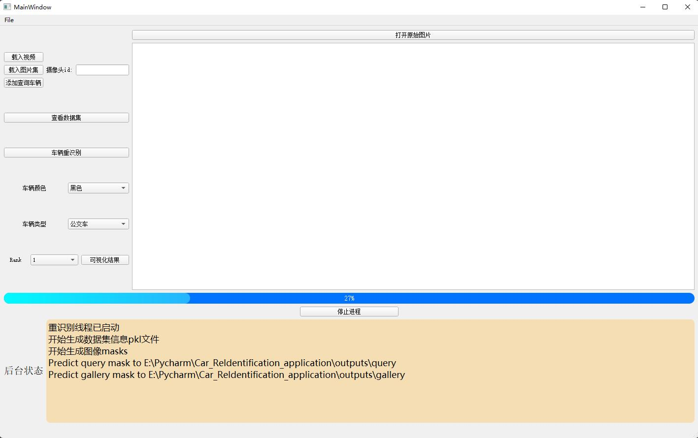

# Car_ReIdentification_Application

## Technology Stack

- pytorch(视频检测和reid部分)
- pyqt(软件基本界面)

## UI design

- 界面概览
  1. 软件主窗口
      
  2. 设置界面
       

- 功能介绍
    - 已完成
        1. 载入视频
        2. 载入图片集
        3. 添加查询车辆
        4. 查看数据集
        5. 车辆重识别
        6. 可视化结果
        7. 打开原始图片
        8. 软件设置界面
    - 未完成
        1. 软件性能优化
        2. 重识别结果可视化优化
        3. UI美化

## Workflow

1. 用户导入监控视频
    - 创建临时的数据集文件夹
    - 软件通过视频检测模块检测视频中的车辆，保存至临时文件夹中形成gallery数据集
2. 用户导入目标车辆图像
3. 重识别模块根据目标车辆图像在gallery数据集中找到正确的车辆，生成结果文件
4. 根据结果文件和用户进一步的筛选结果(color, Vtype)可视化最终结果

## Develop

1. 软件相关配置文件:app.conf
2. Qt样式表(QSS):AppStyleSheet.css

## Preparation

1. 下载重识别网络的权重并保存到配置文件所指定的位置
    - 颜色分类模型权重color_model.pth
    - 车型分类模型权重vehicle_type.pth
    - 车辆解析模型权重parsing_model.pth
    - veri776重识别模型权重veri776_reid.pth
2. 下载视频处理过程中目标检测所用到的模型权重
    - YOLO4目标检测模型权重yolo4_weights.pth

3. 设定好相应的PYTHON_PATH，将car_reid和video_process目录加入到PYTHON_PATH中

## Running

1. `python app.py`

## Evaluation

1. 在设置界面打开评估模式，依赖于正确的车辆id